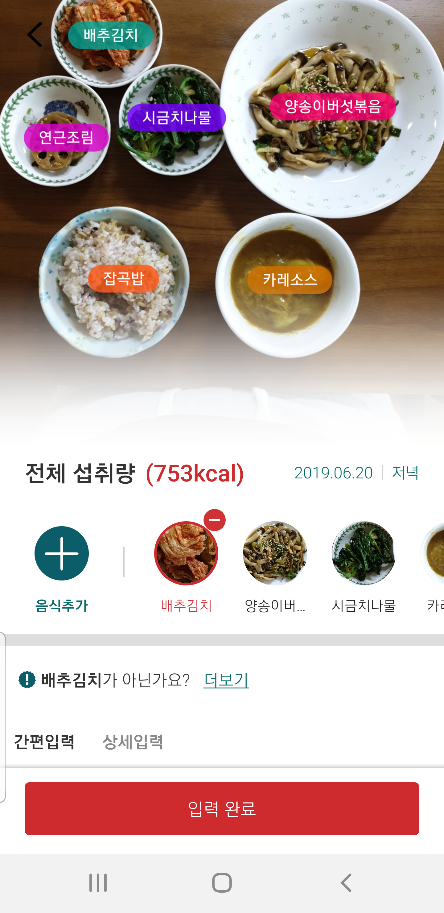
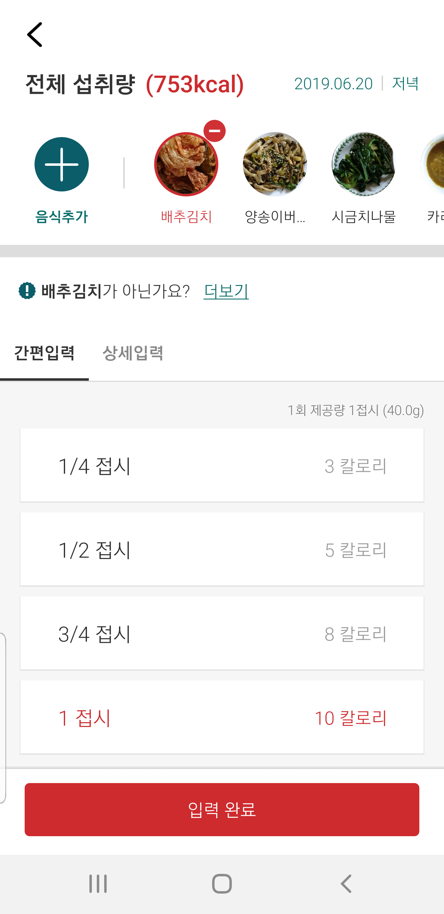

# Android용 FoodLens SDK 메뉴얼

Android용 FoodLens SDK를 사용하여 FoodLens 기능을 이용할 수 있습니다.  
FoodLens SDK는 Network SDK와 UI SDK로 이루어 지며, 자체 UI를 작성할 경우는 Network SDK를, Doinglab에서 제공하는 UI화면까지 사용할 경우는 UI SDK를 사용하셔서 FoodLens의 기능을 이용하실 수 있습니다. 

## [ReleaseNote 바로가기](ReleaseNote.md)

## FoodLens SDK
      
 
 
## 1. 안드로이드 프로젝트 설정
2.3.0 버전부터 FoodLens SDK가 Priavte에서 public으로 변경되었습니다.

### * 중요 2.3.0 이전 사용자 *
기존의 private maven setting을 하실 필요가 없으며,기존 고객은 삭제해주시기 바랍니다.
- 프로젝트에서 app > Gradle Scripts(그래들 스크립트) > build.gradle (Project)를 연 후 allprojects { repositories {}}에 다음 아래 내용이 있다면 삭제.  

#### 아래 코드가 있다면 해당 코드 부분 삭제
#### 신규 프로젝트인 경우 설정 불필요
```java
maven {
     credentials {
         username "[UserName]"
         password "[Password]"
     }
     authentication{
	 basic(BasicAuthentication)
     }
     url "https://bitbucket.org/doing-lab/foodlenssdk-repo/raw/releases"
}
```

### 1.1 Android 10 지원
Android 10 지원을 위해 Compile SDK Version을 29이상으로 설정해 주세요. 프로젝트에서 app > Gradle Scripts(그래들 스크립트) > build.gradle (Module: app)을 연 후 android{} 섹션에 아래와 같은 문구를 추가해 주세요.

```java
android {
        ....
        compileSdkVersion 29
	....       
    }
```

### 1.2 gradle 설정
- minSdkVersion은 19 이상을 사용하시기 바랍니다.
프로젝트에서 app > Gradle Scripts(그래들 스크립트) > build.gradle (Module: app)을 연 후 defaultConfig{} 섹션에 아래와 같은 문구를 추가해 주세요.
```java
   defaultConfig {
        ....
        minSdkVersion 19
	....       
    }
```

 - Optional. Compile Error 발생시 프로젝트에서 app > Gradle Scripts(그래들 스크립트) > build.gradle (Module: app)을 연 후 android{} 섹션에 아래와 같은 문구를 추가해 주세요. (ex) Java version 1.8 일 경우)
```java
compileOptions {
        sourceCompatibility JavaVersion.VERSION_1_8
        targetCompatibility JavaVersion.VERSION_1_8
    }
```

#### 1.2.1 FoodLens SDK 버전 설정
 - 프로젝트에서 app > Gradle Scripts(그래들 스크립트) > build.gradle (Module: app)을 연 후 dependencies{} 섹션에 아래와 같은 문구를 추가해 주세요.
```java
FOODLENS_SDK_VERSION = 2.3.2

```
```java
 implementation "com.doinglab.foodlens:FoodLens:$FOODLENS_SDK_VERSION"
```
 - 예제
 ```java
 apply plugin: 'com.android.application'

android {
    compileSdkVersion 29
    defaultConfig {
        applicationId "com.doinglab.sdk.sample"
        minSdkVersion 19
        targetSdkVersion 29
        versionCode 1
        versionName "1.0"
        testInstrumentationRunner "android.support.test.runner.AndroidJUnitRunner"
        multiDexEnabled true
    }
    buildTypes {
        release {
            minifyEnabled false
            proguardFiles getDefaultProguardFile('proguard-android.txt'), 'proguard-rules.pro'
        }
    }
    compileOptions {
        sourceCompatibility JavaVersion.VERSION_1_8
        targetCompatibility JavaVersion.VERSION_1_8

    }
}

dependencies {
    implementation fileTree(dir: 'libs', include: ['*.jar'])
    implementation 'com.android.support:appcompat-v7:28.0.0'
    implementation 'com.android.support.constraint:constraint-layout:1.1.3'
    testImplementation 'junit:junit:4.12'
    androidTestImplementation 'com.android.support.test:runner:1.0.2'
    androidTestImplementation 'com.android.support.test.espresso:espresso-core:3.0.2'
    implementation "com.doinglab.foodlens:FoodLens:$FOODLENS_SDK_VERSION"
}
```

 - 사용하는 라이브러리의 버전 충돌시 아래와 같이 버전이 충돌되는 라이브러리를 제외하고 SDK가 참조되도록 수정합니다.
  ```java
 implementation ("com.doinglab.foodlens:FoodLens:$FOODLENS_SDK_VERSION") {
    exclude group: 'com.android.support', module: 'appcompat'
    exclude group: 'com.android.support', module: 'design'
    exclude group: 'com.android.support', module: 'support-v4'
    exclude group: 'com.android.support.constraint', module: 'constraint-layout'
}
```

## 2. 리소스(Resources) 및 메니페스트(Manifests) 
AccessToken과 Company, AppToken을 중 한가지만 세팅 합니다.

### 2.1 Access Token만 있는 경우
발급된 AccessToken을 /app/res/values/strings.xml에 추가 합니다.
```xml
<string name="foodlens_access_token">[AccessToken]</string>
```

* Meta data추가
아래와 같이 메타데이터를 Manifest.xml에 추가해 주세요
```xml
<meta-data android:name="com.doinglab.foodlens.sdk.accesstoken" android:value="@string/foodlens_access_token"/> 
```
### 2.2 AppToken, CompanyToken이 있는 경우
발급된 AppToken, CompanyToken을 /app/res/values/strings.xml에 추가 합니다.
```xml
<string name="foodlens_app_token">[AppToken]</string>
<string name="foodlens_company_token">[CompanyToken]</string>
```

* Meta data추가
아래와 같이 메타데이터를 Manifest.xml에 추가해 주세요
```xml
<meta-data android:name="com.doinglab.foodlens.sdk.apptoken" android:value="@string/foodlens_app_token"/> 
<meta-data android:name="com.doinglab.foodlens.sdk.companytoken" android:value="@string/foodlens_company_token"/> 
```

### 2.3 공통
* ProGuard 설정
FoodLens SDK는 ProGuard로 코드 난독화를 적용하면 안 됩니다. FoodLens를 사용하는 애플리케이션을 .apk 파일로 빌드할 때 ProGuard를 적용하려면 설정을 proguard-project.txt파일에 아래의 내용을 추가해 주세요.
```xml
-keep public class com.doinglab.foodlens.sdk.** {
       *;
}
```

## 3.독립 FoodLens 서버 주소 설정
 - Meta data추가 
   아래와 같이 메타데이터를 Manifest.xml에 추가해 주세요
```xml
//프로토콜과 및 포트를 제외한 순수 도메인 주소 혹은 IP주소 e.g) www.foodlens.com, 123.222.100.10
<meta-data android:name="com.doinglab.foodlens.sdk.serveraddr" android:value="[server_address]"/> 
```  


## 4. SDK 사용법 사용법

### 4.1 Network API 사용법
#### 4.1.1 음식 인식 기능 사용
1. NetworkService를 생성합니다.
2. predictMultipleFood 메소드를 호출 합니다.  
   파라미터는 Jpeg image와 RecognizeResultHandler 입니다.  
   Jpeg이미지는 카메라 촬영 원본 이미지를 전달해 줍니다.  
   ※ 이미지가 작은경우 인식율이 낮아질 수 있습니다.  
3. 코드 예제  
```java
//Create Network Service
final NetworkService ns = FoodLens.createNetworkService(context);
//Call prediction method.
ns.predictMultipleFood(byteData, new RecognizeResultHandler() {
	@Override
	public void onSuccess(RecognitionResult result) {
    	    List<FoodPosition> foodPosList = result.getFoodPositions();     //Get food positions

	    for(FoodPosition fp : foodPosList) {
		List<Food> foods = fp.getFoods();       //Get food candidates at this position
		for(Food food : foods) {
		    //Print out food name at this position
		    Log.i("FoodLens", food.getFoodName());
		}
	    }
	}

	@Override
	public void onError(BaseError errorReason) {
	    Log.e("FoodLens", errorReason.getMessage());
	}
});		    
```
#### 4.1.2 음식 결과 영양정보 얻기 모드
옵션에 따라 인식결과의 영양정보를 다르게 얻을 수 있다.
```java
//Create Network Service
final NetworkService ns = FoodLens.createNetworkService(context);
ns.setNutritionRetrieveMode(NutritionRetrieveMode.TOP1_NUTRITION_ONLY); //예측 값중 예측 우선순위가 가장 높은 1개의 영양 정보만 리턴한다.
ns.predictMultipleFood(byteData, new RecognizeResultHandler() {
...
```

#### 4.1.3 음식 영양정보 얻기
1. NetworkService를 생성합니다.
2. getNutritionInfo 메소드를 호출 합니다.  
   파라미터는 FoodID와 NutritionResultHandler 입니다.  
   ※ FoodID의 경우 Prediction결과 및 AutoComplete결과에서 획득 할 수 있습니다.  
- 코드 예제  
```java
//Create Network Service
final NetworkService ns = FoodLens.createNetworkService(context);
ns.getNutritionInfo([food_id], new NutritionResultHandler() {
	@Override
	public void onSuccess(NutritionResult result) {
	    //Print out calorie information
	    Log.i("FoodLens", String.format("Calorie : %f", result.getNutrition().getCalories()));
	}

	@Override
	public void onError(BaseError errorReason) {
	    Log.e("FoodLens", errorReason.getMessage());
	}
});
```
#### 4.1.4 음식항목 검색하기
1. NetworkService를 생성합니다.
2. searchFoodsByName 메소드를 호출 합니다.  
   파라미터는 음식이름과 SearchResultHandler 입니다.  
- 코드 예제  
```java

ns = FoodLens.createNetworkService(getApplicationContext());
ns.searchFoodsByName("라면", new SearchResultHandler() {
	@Override
	public void onSuccess(FoodSearchResult result) {

	}

	@Override
	public void onError(BaseError errorReason) {

	}
});
```

### 4.2 UI API 사용법
#### 4.2.1 UI Service의 카메라 모듈 및 인식 기능 사용
1. UIService를 생성합니다.
2. startFoodLensCamera 메소드를 호출 합니다.  
- 코드 예제
```java
//Define UI Service
private UIService uiService;

...

//Create UI Service
uiService = FoodLens.createUIService(context);
uiService.startFoodLensCamera(MainActivity.this, new UIServiceResultHandler() {
                    @Override
                    public void onSuccess(UserSelectedResult result) {     
		    	//implement code
                    }

                    @Override
                    public void onCancel() {
                        Log.d("MSG_LOG", "Recognition Cancel");
                    }

                    @Override
                    public void onError(BaseError error) {
                        Log.d("MSG_LOG", error.getMessage());
                    }
                });
		
```

3. UIService의 startFoodLensCamera를 호출한 Activity의 onActivityResult(Override)에 
   UIService의 onActivityResult 메소드를 호출합니다. 
- 코드예제
```java

@Override
protected void onActivityResult(int requestCode, int resultCode, @Nullable Intent data) {
	....
	uiService.onActivityResult(requestCode, resultCode, data);
	....
}
```

#### 4.2.2 UI Service의 Data 수정 기능
1. UIService를 생성합니다.
2. 3.1.2과 3.2.1에서 획득한 영양정보를 recognitionResult에 저장합니다.
3. startFoodLensDataEdit 메소드를 호출 합니다. 
- 코드 예제
```java
//Define UI Service
private UIService uiService;
RecognitionResult recognitionResult = null;

...

//Create UI Service
uiService = FoodLens.createUIService(context);
uiService.startFoodLensDataEdit(MainActivity.this, recognitionResult, new UIServiceResultHandler() {
                    @Override
                    public void onSuccess(UserSelectedResult result) {     
		    	//implement code
                    }

                    @Override
                    public void onCancel() {
                        Log.d("MSG_LOG", "Recognition Cancel");
                    }

                    @Override
                    public void onError(BaseError error) {
                        Log.d("MSG_LOG", error.getMessage());
                    }
                });
		
```

4. UIService의 startFoodLensDataEdit 호출한 Activity의 onActivityResult(Override)에 
   UIService의 onActivityResult 메소드를 호출합니다. 
- 코드예제
```java

@Override
protected void onActivityResult(int requestCode, int resultCode, @Nullable Intent data) {
	....
	uiService.onActivityResult(requestCode, resultCode, data);
	....
}
```

#### 4.2.3 영양정보 추출 모드
인식 결과를 리턴 받을 때 추천항목의 영양소까지 받을지 여부를 선택 할 수 있다.
```java
uiService.setUiServiceMode(UIServiceMode.USER_SELECTED_WITH_CANDIDATES); //UIServiceMode.USER_SELECTED_ONLY 선택시 사용자가 선택항 항목의 영양소만 반환된다.
```

#### 4.2.4 테마 및 옵션 변경
##### 4.2.4.1 UI 테마 변경
FoodLens UI 의 여러 요소에 개별 색을 적용할 수 있습니다.
```java
BottomWidgetTheme bottomWidgetTheme =  new BottomWidgetTheme(this);
bottomWidgetTheme.setButtonTextColor(0xffffff);
bottomWidgetTheme.setWidgetRadius(30);

DefaultWidgetTheme defaultWidgetTheme = new DefaultWidgetTheme(this);
defaultWidgetTheme.setWidgetColor(0xffffff);

ToolbarTheme toolbarTheme = new ToolbarTheme(this);
toolbarTheme.setBackgroundColor(0xffffff);

uiService.setBottomWidgetTheme(bottomWidgetTheme);
uiService.setDefaultWidgetTheme(defaultWidgetTheme);
uiService.setToolbarTheme(toolbarTheme);
```
##### 4.2.4.2 FoodLens 옵션 변경
FoodLens의 사용 옵션을 변경 할 수 있습니다.
```
FoodLensBundle bundle = new FoodLensBundle();
bundle.setEnableManualInput(true);  //검색입력 활성화 여부
bundle.setEatType(1);               //식사 타입 수동 선택
bundle.setSaveToGallery(true);      //갤러리 기능 활성화 여부
bundle.setUseImageRecordDate(true); //촬영한 이미지 갤러리 저장 여부
bundle.setEnableCameraOrientation(true);  //카메라 회전 기능 지원 여부
uiService.setDataBundle(bundle);

```


#### 4.3 RecognitionResult의 JSON변환
RecognitionResult 객체를 JSON 문자열로 변환할 수 있습니다.
```java
String json = recognitionResult.toJSONString();  //json생성
```

JSON 문자열을 PredictionResult 객체로 변환할 경우, 아래처럼 사용하실 수 있습니다.
```java
RecognitionResult result = RecognitionResult.create(json); 
```


#### 4.4 섭취한 영양정보 산출 계산식
```java
for(int i = 0; i < recognitionResult.getFoodPositions().size(); i++) {
	FoodPosition foodPosition = foodPositions.get(i);
	float eatAmount = foodPosition.getEatAmount(); // 사용자가 설정한 1회 섭취량
	Nutrition nutrition = foodPosition.getUserSelectedFood().getNutrition(); // 선택한 음식에 대한 Raw 영양정보 데이터
	eatAmount * nutrition.getCarbonHydrate(); // 1회 섭취한 음식에 대한 탄수화물 섭취량
	eatAmount * nutrition.getProtein(); // 1회 섭취한 음식에 대한 단백질 섭취량
	eatAmount * nutrition.getFat(); // 1회 섭취한 음식에 대한 지방 섭취량
	...
}
```

...

## 5. SDK 상세 스펙  
[상세 API 명세](https://doinglab.github.io/android/index.html)  

## 6. SDK 사용 예제  
[Sample 예제](SampleCode/)

## 7. JSON Format
[JSON Format](../JSON%20Format)

[JSON Sample](../JSON%20Sample)

## 8. Author
hyunsuk.lee@doinglab.com

## 9. License
FoodLens is available under the MIT license. See the LICENSE file for more info.
