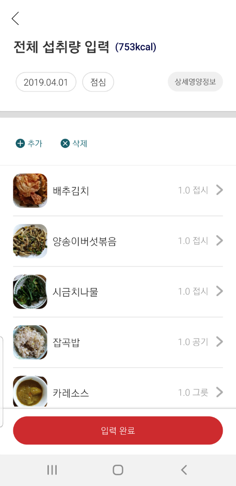
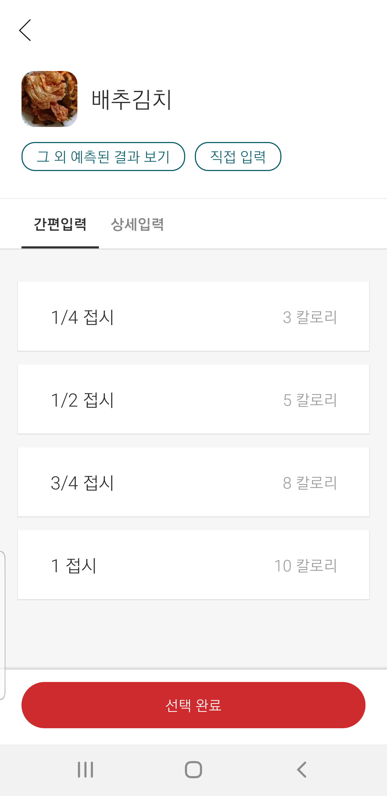

# Android용 FoodLens SDK 메뉴얼

Android용 FoodLens SDK를 사용하여 FoodLens 기능을 이용할 수 있습니다.  
FoodLens SDK는 Network SDK와 UI SDK로 이루어 지며, 자체 UI를 작성할 경우는 Network SDK를, Doinglab에서 제공하는 UI화면까지 사용할 경우는 UI SDK를 사용하셔서 FoodLens의 기능을 이용하실 수 있습니다. 

## FoodLens SDK V2
      

## FoodLens SDK V1
      

## 문서 Annotation - 필독
### - "[XXX]" 대괄호 내용은 실제 내용으로 변경되어야 합니다.
### - 대괄호까지 삭제한 후 실제 내용이 들어가야 합니다.
### - e.g. username "[UserName]" -> username "myid"
 
 
## 1. 안드로이드 프로젝트 설정
- 프로젝트에서 app > Gradle Scripts(그래들 스크립트) > build.gradle (Project)를 연 후 allprojects { repositories {}}에 다음 아래 내용을 추가해 주세요.  
   **※ 두잉랩에서 제공해드린 Repository용 UserName과 Password로 변경해주세요.**  
   
```java
maven {
     credentials {
         username "[UserName]"
         password "[Password]"
     }
     authentication{
	 basic(BasicAuthentication)
     }
     url "https://bitbucket.org/doing-lab/foodlenssdk-repo/raw/releases"
}

```
예제)
```java
allprojects {
    repositories {
	    .....
		
        maven {
            credentials {
                username "[UserName]"
                password "[Password]"
            }
            authentication{
                basic(BasicAuthentication)
            }
            url "https://bitbucket.org/doing-lab/foodlenssdk-repo/raw/releases"
        }
    }
```

- minSdkVersion은 19 이상을 사용하시기 바랍니다.
프로젝트에서 app > Gradle Scripts(그래들 스크립트) > build.gradle (Module: app)을 연 후 defaultConfig{} 섹션에 아래와 같은 문구를 추가해 주세요.
```java
   defaultConfig {
        ....
        minSdkVersion 19
	....       
    }
```

 - Optional. Compile Error 발생시 프로젝트에서 app > Gradle Scripts(그래들 스크립트) > build.gradle (Module: app)을 연 후 android{} 섹션에 아래와 같은 문구를 추가해 주세요. (ex) Java version 1.8 일 경우)
```java
compileOptions {
        sourceCompatibility JavaVersion.VERSION_1_8
        targetCompatibility JavaVersion.VERSION_1_8
    }
```

### FoodLens SDK V2 버전
 - 프로젝트에서 app > Gradle Scripts(그래들 스크립트) > build.gradle (Module: app)을 연 후 dependencies{} 섹션에 아래와 같은 문구를 추가해 주세요.
```java
FOODLENS_SDK_VERSION = 2.0.21
```
```java
 implementation "com.doinglab.foodlens:FoodLens:$FOODLENS_SDK_VERSION"
```
** [ReleaseNote](ReleaseNote.md)

### FoodLens SDK V1 버전
 - 프로젝트에서 app > Gradle Scripts(그래들 스크립트) > build.gradle (Module: app)을 연 후 dependencies{} 섹션에 아래와 같은 문구를 추가해 주세요.
 
```java
FOODLENS_SDK_VERSION = 1.0.11
```
```java
 implementation "com.doinglab.foodlens:FoodLens:$FOODLENS_SDK_VERSION"
```
 - 예제
 ```java
 apply plugin: 'com.android.application'

android {
    compileSdkVersion 28
    defaultConfig {
        applicationId "com.doinglab.sdk.sample"
        minSdkVersion 19
        targetSdkVersion 28
        versionCode 1
        versionName "1.0"
        testInstrumentationRunner "android.support.test.runner.AndroidJUnitRunner"
        multiDexEnabled true
    }
    buildTypes {
        release {
            minifyEnabled false
            proguardFiles getDefaultProguardFile('proguard-android.txt'), 'proguard-rules.pro'
        }
    }
    compileOptions {
        sourceCompatibility JavaVersion.VERSION_1_8
        targetCompatibility JavaVersion.VERSION_1_8

    }
}

dependencies {
    implementation fileTree(dir: 'libs', include: ['*.jar'])
    implementation 'com.android.support:appcompat-v7:28.0.0'
    implementation 'com.android.support.constraint:constraint-layout:1.1.3'
    testImplementation 'junit:junit:4.12'
    androidTestImplementation 'com.android.support.test:runner:1.0.2'
    androidTestImplementation 'com.android.support.test.espresso:espresso-core:3.0.2'
    implementation "com.doinglab.foodlens:FoodLens:$FOODLENS_SDK_VERSION"
}
```

 - 사용하는 라이브러리의 버전 충돌시 아래와 같이 버전이 충돌되는 라이브러리를 제외하고 SDK가 참조되도록 수정합니다.
  ```java
 implementation ("com.doinglab.foodlens:FoodLens:$FOODLENS_SDK_VERSION") {
    exclude group: 'com.android.support', module: 'appcompat'
    exclude group: 'com.android.support', module: 'design'
    exclude group: 'com.android.support', module: 'support-v4'
    exclude group: 'com.android.support.constraint', module: 'constraint-layout'
}
```

## 2. 리소스(Resources) 및 메니페스트(Manifests) 수정
 - Access Token 추가  
   발급된 AccessToken을 /app/res/values/strings.xml에 추가 합니다.
```xml
<string name="foodlens_access_token">[AccessToken]</string>
```

 - Meta data추가 
   아래와 같이 메타데이터를 Manifest.xml에 추가해 주세요
```xml
<meta-data android:name="com.doinglab.foodlens.sdk.accesstoken" android:value="@string/foodlens_access_token"/> 
```  

 - ProGuard 설정
   FoodLens SDK는 ProGuard로 코드 난독화를 적용하면 안 됩니다. FoodLens를 사용하는 애플리케이션을 .apk 파일로 빌드할 때 ProGuard를 적용하려면 설정을 proguard-project.txt파일에 아래의 내용을 추가해 주세요.
```xml
-keep public class com.doinglab.foodlens.sdk.** {
       public protected *;
}
```
## 3. SDK 사용법 사용법

### 3.1 Network API 사용법
#### 3.1.1 음식 인식 기능 사용
1. NetworkService를 생성합니다.
2. predictMultipleFood 메소드를 호출 합니다.  
   파라미터는 Jpeg image와 RecognizeResultHandler 입니다.  
   Jpeg이미지는 카메라 촬영 원본 이미지를 전달해 줍니다.  
   ※ 이미지가 작은경우 인식율이 낮아질 수 있습니다.  
3. 코드 예제  
```java
//Create Network Service
final NetworkService ns = FoodLens.createNetworkService(context);
//Call prediction method.
ns.predictMultipleFood(byteData, new RecognizeResultHandler() {
	@Override
	public void onSuccess(RecognitionResult result) {
    	    List<FoodPosition> foodPosList = result.getFoodPositions();     //Get food positions

	    for(FoodPosition fp : foodPosList) {
		List<Food> foods = fp.getFoods();       //Get food candidates at this position
		for(Food food : foods) {
		    //Print out food name at this position
		    Log.i("FoodLens", food.getFoodName());
		}
	    }
	}

	@Override
	public void onError(BaseError errorReason) {
	    Log.e("FoodLens", errorReason.getMessage());
	}
});		    
```
#### 3.1.2 영양정보 획득
1. NetworkService를 생성합니다.
2. getNutritionInfo 메소드를 호출 합니다.  
   파라미터는 FoodID와 NutritionResultHandler 입니다.  
   ※ FoodID의 경우 Prediction결과 및 AutoComplete결과에서 획득 할 수 있습니다.  
- 코드 예제  
```java
//Create Network Service
final NetworkService ns = FoodLens.createNetworkService(context);
ns.getNutritionInfo([food_id], new NutritionResultHandler() {
	@Override
	public void onSuccess(NutritionResult result) {
	    //Print out calorie information
	    Log.i("FoodLens", String.format("Calorie : %f", result.getNutrition().getCalories()));
	}

	@Override
	public void onError(BaseError errorReason) {
	    Log.e("FoodLens", errorReason.getMessage());
	}
});
```

### 3.2 UI API 사용법
#### 3.2.1 UI Service의 카메라 모듈 및 인식 기능 사용
1. UIService를 생성합니다.
2. startFoodLensCamera 메소드를 호출 합니다.  
- 코드 예제
```java
//Define UI Service
private UIService uis;

...

//Create UI Service
uis = FoodLens.createUIService(context);
uis.startFoodLensCamera(MainActivity.this, new UIServiceResultHandler() {
                    @Override
                    public void onSuccess(UserSelectedResult result) {     
		    	//implement code
                    }

                    @Override
                    public void onCancel() {
                        Log.d("MSG_LOG", "Recognition Cancel");
                    }

                    @Override
                    public void onError(BaseError error) {
                        Log.d("MSG_LOG", error.getMessage());
                    }
                });
		
```

3. UIService의 startFoodLensCamera를 호출한 Activity의 onActivityResult(Override)에 
   UIService의 onActivityResult 메소드를 호출합니다. 
- 코드예제
```java

@Override
protected void onActivityResult(int requestCode, int resultCode, @Nullable Intent data) {
	....
	uis.onActivityResult(requestCode, resultCode, data);
	....
}
```

#### 3.2.2 UI Service의 Data 수정 기능
1. UIService를 생성합니다.
2. 3.1.2과 3.2.1에서 획득한 영양정보를 recognitionResult에 저장합니다.
3. startFoodLensDataEdit 메소드를 호출 합니다. 
- 코드 예제
```java
//Define UI Service
private UIService uis;
RecognitionResult recognitionResult = null;

...

//Create UI Service
uis = FoodLens.createUIService(context);
uis.startFoodLensDataEdit(MainActivity.this, recognitionResult, new UIServiceResultHandler() {
                    @Override
                    public void onSuccess(UserSelectedResult result) {     
		    	//implement code
                    }

                    @Override
                    public void onCancel() {
                        Log.d("MSG_LOG", "Recognition Cancel");
                    }

                    @Override
                    public void onError(BaseError error) {
                        Log.d("MSG_LOG", error.getMessage());
                    }
                });
		
```

4. UIService의 startFoodLensDataEdit 호출한 Activity의 onActivityResult(Override)에 
   UIService의 onActivityResult 메소드를 호출합니다. 
- 코드예제
```java

@Override
protected void onActivityResult(int requestCode, int resultCode, @Nullable Intent data) {
	....
	uis.onActivityResult(requestCode, resultCode, data);
	....
}
```

...

#### 3.3 RecognitionResult의 저장과 생성
- 코드예제
```java
String json = recognitionResult.toJSONString();
RecognitionResult result = RecognitionResult.create(json);
```

...


## 4. SDK 상세 스펙  
[상세 API 명세](https://doinglab.github.io/android/index.html)  

## 5. SDK 사용 예제  
[Sample 예제](SampleCode/)

## 6. JSON Format
[JSON Format](../JSON%20Format)

## 7. Author
hyunsuk.lee@doinglab.com

## 8. License
FoodLens is available under the MIT license. See the LICENSE file for more info.
