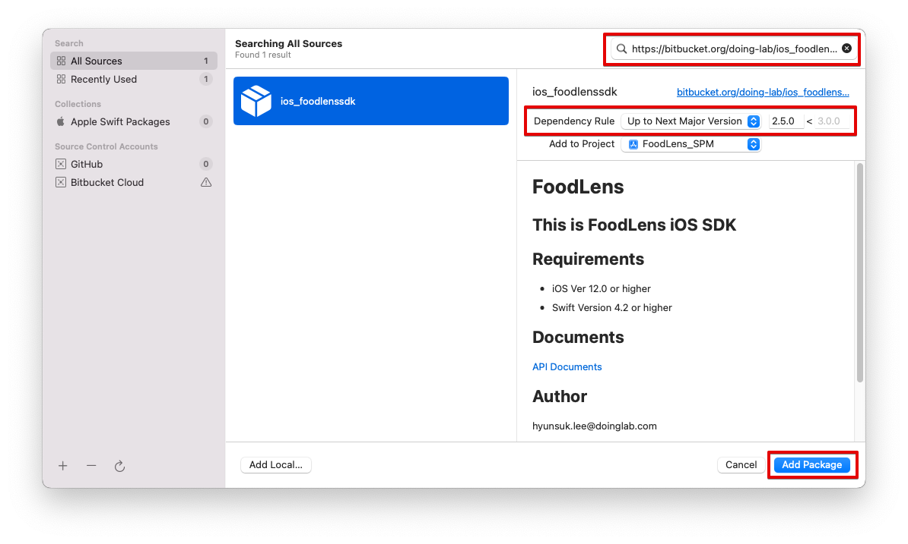

# iOS FoodLens SDK 메뉴얼
iOS용 FoodLens SDK를 사용하여 FoodLens 기능을 이용할 수 있습니다.  
FoodLens SDK는 Network SDK와 UI SDK로 이루어 지며, 자체 UI를 작성할 경우는 Network SDK를, Doinglab에서 제공하는 UI화면까지 사용할 경우는 UI SDK를 사용하셔서 FoodLens의 기능을 이용하실 수 있습니다. 

## [ReleaseNote 바로가기](ReleaseNote.md)

## FoodLens SDK
      

## Requirements

* iOS Ver 12.0 이상
* Swift Version 4.2 이상
* 2.4.1 버전부터 private repository가 아닌 cocoapod public repository에 릴리즈 됩니다.


## 1. SDK 설치 및 설정
### 1.1 Cocodpod
Podfile 에 아래와 같은 구문을 추가하여 FoodLens 를 import 합니다.

```ruby
platform :ios, '12.0'

target 'FoodLensApp' do
  # Comment the next line if you're not using Swift and don't want to use dynamic frameworks
  use_frameworks!
  pod 'FoodLens', '2.5.4'
  ....
```

pod install시 Foodlens 검색 안될시 repository 업데이트와 함께 설치
```
pod install --repo-update
```

### 기존 2.4.0 이전 사용자
기존 private repository를 사용했던 사용자는 아래 커맨드를 활용하여 기존 foodlens private repo를 삭제 후 업데이트
```
pod repo remove [repo name]
```
### 1.2 SPM
File -> AddPackage 혹은 ProjectSetting -> AddPackage 선택

Search or Enter Package URL에 "https://bitbucket.org/doing-lab/ios_foodlenssdk.git" 입력 후 FoodLens 추가

<center></center>
<center></center>

## 2. 리소스(Resources) 및 info.plist 수정
아래 항목 Info.plist에 추가
- Privacy - Camera Usage Description
- Privacy - Photo Library Additions Usage Description
- Privacy - Photo Library Usage Description


## 3. FoodLens 독립 서버 주소 설정

기본 FoodLens 서버가 아닌 독립 서버를 운용할 경우 서버 주소를 설정 할 수 있습니다.
```swift
//info.plist에 FoodLensServerAddr 항목을 추가하고 서버 주소를 추가
//도메인 이름만 추가 http, https등 프로토콜은 추가하지 않음 e.g.) www.domain.com, 132.213.111.23 등
```


## 4. SDK 사용법
### 4.1 Network API 사용법
Network API는 FoodLens기능을 이미지 파일기반으로 동작하게 하는 기능입니다.
결과를 이용하여 각자에 맞는 UI를 직접 개발 할 수 있습니다.

#### 4.1.1 음 인식기능 사용
1. NetworkService를 생성합니다.
2. predictMultipleFood 메소드를 호출 합니다.
파라미터로 UIImage로 로드왼 이미지를 전달합니다.
※ 이미지가 작은경우 인식율이 낮아질 수 있습니다.
3. 코드 예제

```swift
let networkService = FoodLens.createNetworkService(nutritionRetrieveMode: .allNutirition, accessToken: "<Access Token Here>") //AccessToken is given to you
networkService!.predictMultipleFood(image: pickedImage) { (result : PredictionResult?, status : ProcessStatus) in
    
}
```
#### 4.1.2 음식 인식기능 사용
옵션에 따라 인식결과의 영양정보를 다르게 얻을 수 있다.
createNetworkService의 nutritionRetrieveMode 값을 설정하여 변경
```swift
let networkService = FoodLens.createNetworkService(nutritionRetrieveMode: .allNutirition, accessToken: "<Access Token Here>") 
```

#### 4.1.3 음식 영양정보 얻기
1. NetworkService를 생성합니다.
2. getNutritionInfo 메소드를 호출 합니다.
   파라미터로 FoodID를 넘겨 줍니다.
※ FoodID의 경우 Prediction결과 및 getFoodsByName 결과에서 획득 할 수 있습니다.

```swift
let networkService = FoodLens.createNetworkService(nutritionRetrieveMode: .allNutirition, accessToken: "<Access Token Here>") 
networkService.getNutritionInfo(foodId: 100) { nutrition, state in
    if state.state == .success {
      print(nutrition?.calories)
    } else {
      print("Nutrition retreveal error")
    }
}
```

#### 4.1.4 음식항목 검색하기
1. NetworkService를 생성합니다.
2. getFoodsByName 메소드를 호출 합니다.
   파라미터로 음식명을 넘겨 줍니다.
3. 음식명이 포함된 모든 항목을 리턴해 줍니다.

```swift
let networkService = FoodLens.createNetworkService(nutritionRetrieveMode: .allNutirition, accessToken: "<Access Token Here>") 
networkService.getFoodsByName(foodName: "라면") { foodlist in
  for item in foodlist {
    print(item.foodname)
  }
}
```


### 4.2 UI API 사용법
UI API는 FoodLens 에서 제공하는 기본 UI를 활용하여 서비스를 개발 할 수 있는 기능입니다.
UI API는 간단한 화면 Customize기능을 포함하고 있습니다.
(2.0.27 버전부터는 Light Mode 로만 UI 가 표시됩니다.)

#### 4.2.1 UI Service의 모듈 및 인식 기능 사용
카메라 모듈, 검색 모듈, 갤러리 모듈 3가지 방식을 사용하여  UI Service의 인식 기능을 사용할 수 있습니다.

#### 4.2.1.1 UI Service 생성
UIService를 생성합니다.

```swift
FoodLens.uiServiceMode = .userSelectedWithCandidates

//NOTE AccessToken만 있는 경우
let uiService = FoodLens.createUIService(accessToken: "<Access Token Here>")

//NOTE AppToken, CompanyToken모두 있는 경우
let uiService = FoodLens.createUIService(appToken: "<App Token Here>", companyToken: "<Company Token Here>")
```

#### 4.2.1.2 모듈 사용
1. 카메라 모듈 사용

startCameraUIService 메소드를 호출 합니다.

```swift
uiService?.startCameraUIService(parent: self, completionHandler: self)
```


2. 검색 모듈 사용

startSearchUIService 메소드를 호출 합니다.

```swift
uiService?.startSearchUIService(parent: self, completionHandler: self)
```

3. 갤러리 모듈 사용

startGalleryUIService 메소드를 호출 합니다.

```swift
uiService?.startGalleryUIService(parent: self, completionHandler: self)
```

#### 4.2.1.3 completionHandler 설정
completionHandler 는 callback 을 받을 swift protocol 이며, 아래와 같이 정의되어 있습니다.

```swift
public protocol UserServiceResultHandler {
    func onSuccess(_ result : RecognitionResult)    //called when process is succeeded
    func onCancel()                                 //called when user cancels recognition
    func onError(_ error : BaseError)               //called when error is occurred
}
```

### 4.2.2 UI Service의 Data 수정 기능
음식 인식 결과를 수정해야 할 경우, 아래와 같이 사용하실 수 있습니다.  

```swift
let mealData = PredictionResult.create(json: jsonString)
FoodLens.uiServiceMode = .userSelectedWithCandidates

let uiService = FoodLens.createUIService(accessToken: "<Access Token Here>") //AccessToken is given to you
uiService.startEditUIService(mealData, parent: self, completionHandler: CallbackObject())    
```
completionHandler 는 callback 을 받을 swift protocol 입니다.


### 4.2.3 영양정보 추출 모드
인식 결과를 리턴 받을 때 추천항목의 영양소까지 받을지 여부를 선택 할 수 있다.
```swift
//userSelectedWithCandidates 사용자 선택외 추천된 항목의 모든 영양정보가 반환된다.
//userSelectedOnly 선택시 사용자가 선택항 항목의 영양소만 반환된다.
FoodLens.uiServiceMode = .userSelectedWithCandidates 
let uiService = FoodLens.createUIService(accessToken: "<Access Token Here>") //AccessToken is given to you
uiService.startEditUIService(mealData, parent: self, completionHandler: CallbackObject())    

```

### 4.2.4 테마 및 옵션 변경
#### 4.2.4.1 UI테마 변경
FoodLens UI 의 여러 요소에 개별 색을 적용할 수 있습니다. 

```swift
let navTheme = NavigationBarTheme(foregroundColor : UIColor.white, backgroundColor : UIColor.black)
let toolbarTheme = ToolBarButtonTheme(backgroundColor: UIColor.white, buttonTheme: ButtonTheme(backgroundColor: UIColor.black, textColor: UIColor.white, borderColor: UIColor.clear))
let buttonTheme = ButtonTheme(backgroundColor: UIColor.blue, textColor: UIColor.green, borderColor: UIColor.black)
let widgetButtonTheme = ButtonTheme(backgroundColor: UIColor.black, textColor: UIColor.blue, borderColor: UIColor.red)
       
let uiService = FoodLens.createUIService(accessToken:  "<Access Token Here>", navigationBarTheme: navTheme, toolbarTheme: toolbarTheme, buttonTheme: buttonTheme,  widgetButtonTheme : widgetButtonTheme)
FoodLens.uiServiceMode = .userSelectedWithCandidates
uiService.startUIService(parent: self, completionHandler: CallbackObject())   
```


#### 4.2.4.2 FoodLens 옵션 변경
FoodLens의 사용 옵션을 변경 할 수 있습니다.
```swift
FoodLens.isEnableCameraOrientation = false                  //카메라 회전 기능 지원 여부
FoodLens.isEnableManualInput = true                         //검색입력 활성화 여부
let calendar = Calendar.autoupdatingCurrent
FoodLens.eatDate = calendar.date(from: dateComponents)!     //현재 시간 설정 기능
FoodLens.isSaveToGallery = false                            //촬영한 이미지 갤러리 저장 여부 
FoodLens.isUseImageRecordDate =  false                      //갤러리에서 이미지 불러올 때 촬영 일자 사용여부 (ture일경우 선택 팝업표시)
FoodLens.eatType = MealType.init(rawValue: 1)               //식사 타입 수정 선택
FoodLens.isEnablePhtoGallery  = true                        //카메라 화면에서 갤러리 버튼 활성화 여부
FoodLens.language = .en					                       //제동되는 음식 정보 언어 설정 (음식정보 외에 UI에 표시되는 텍스트의 언어는 기기에 설정된 언어로 표시)
uiService.startUIService(parent: self, completionHandler: CallbackObject())
  
```

#### 4.2.4.3 식사 타입 자동 설정
사용자가 FoodLens.eatType 이용하여 식사타입 설정을 직접 하지 않은 경우, 음식 식사 타입은 기준 시간을 기준으로 자동설정됨
설정되는 시간 값
```
아침 : 5시 ~ 10시
아침간신 : 10 ~ 11시
점심 : 11시 ~ 13시
점심간신 : 13시 ~ 17시
저녁 : 17시 ~ 20시
야식 : 20시 ~ 5시
```
### 4.2.5 JSON 변환

UserServiceResultHandler.onSuccess 함수의 파라미터로 전달되는 RecognitionResult 객체를 JSON 문자열로 변환할 수 있습니다. 

```swift

func onSuccess(_ result : RecognitionResult) {
    let resultString = result.toJSONString()! //will return JSON string
    print(resultString)
}
```
 
JSON 문자열을 PredictionResult 객체로 변환할 경우, 아래처럼 사용하실 수 있습니다.

```swift
let predictResult = PredictionResult.create(json: jsonString)
```
PredictionResult 은 RecognitionResult protocol 의 구현체 입니다.

### 4.2.6 영양성분 계산
영양성분은 1회 기준량으로 제공되며, 같이 제공되는 섭취량을 곱하여 실제 영양성분을 계산할 수 있습니다.
```swift
    for index in 0 ..< result.foodPositionList.count {
        let eatAmount = result.foodPositionList[index].eatAmount
        let nutrition = result.foodPositionList[index].userSelectedFood?.nutrition
        eatAmount * nutrition?.carbonhydrate // // 1회 섭취한 음식에 대한 탄수화물 섭취량
        eatAmount * nutrition?.protein // // 1회 섭취한 음식에 대한 단백질 섭취량
        eatAmount * nutrition?.fat // // 1회 섭취한 음식에 대한 지방 섭취량
        ...
    }
```

## 5.SDK 상세 스펙  
[API Documents](https://doinglab.github.io/ios/index.html)

## SDK 사용 예제 
[Sample](SampleCode/)

## JSON Format
[JSON Format](../JSON%20Format)

[JSON Sample](../JSON%20Sample)

## Author
hyunsuk.lee@doinglab.com

## License
FoodLens is available under the MIT license. See the LICENSE file for more info.
